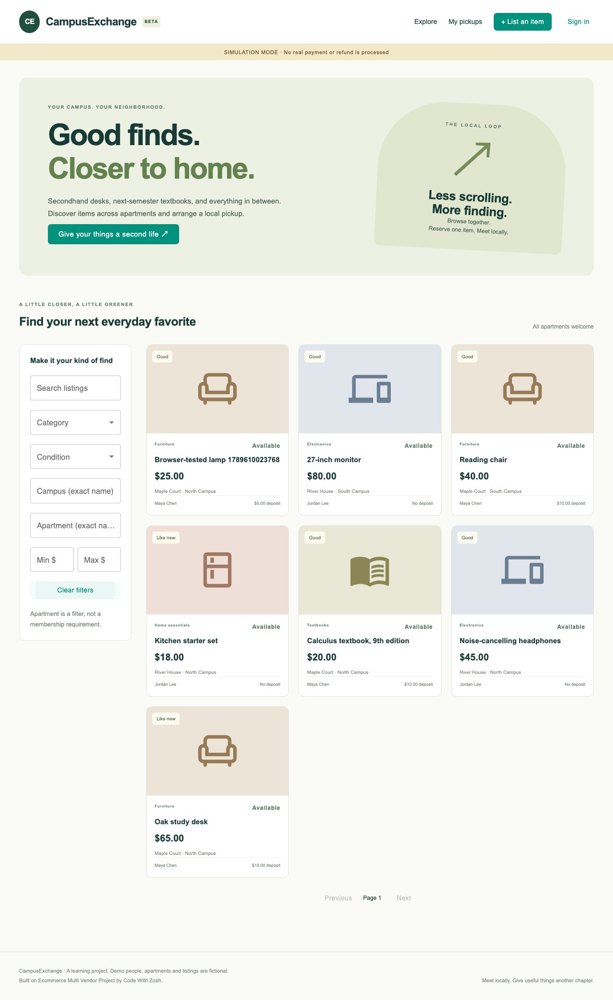

# CampusExchange

A campus and nearby-apartment secondhand marketplace built by adapting the supplied **Ecommerce Multi Vendor Project-2**. Java 17 · Spring Boot 3.3.2 · MySQL · React · TypeScript · Vite. Single Spring Boot application, one database, one React client.

[Source attribution](ATTRIBUTION.md) · [Data model and state transitions](docs/ARCHITECTURE.md) · [Demo](docs/DEMO.md) · [Tests](docs/TESTING.md) · [Debugging notes](docs/MAINTENANCE.md) · [Original vs new contributions / interview preparation](docs/CONTRIBUTIONS.md)



## What you can do

- Browse across apartments without an account; filter by keyword, category, price, condition, campus and apartment.
- Use one account to buy and publish one-of-a-kind listings. No business registration, bank details or commercial seller onboarding.
- Choose a seller-provided pickup time. A database transaction locks the item so only one reservation can own it.
- Reserve immediately without a deposit, or hold the item while paying an optional refundable deposit.
- View buying/selling reservations, cancel before completion, and have the seller confirm the handoff.
- See precise pickup instructions only as a confirmed transaction participant.

English UI; fictional demo data. USD only. The offline balance is not collected by the platform. No real seller payouts, penalties, arbitration, AI chatbot, multi-vendor checkout or production payment claims.

## Run locally

Prerequisites: JDK **17**, Node **22.12+**, npm, and MySQL **8.4** (or Docker Compose for the database). Maven is downloaded by the included wrapper. Use a **new database** for this adaptation.

```sh
cp .env.example .env
openssl rand -hex 32
```

Edit `.env`: put the generated value in `JWT_SECRET`, set `DB_PASSWORD` and `MYSQL_ROOT_PASSWORD`, and keep `PAYMENT_MODE=mock` for the first run. Do not commit `.env`. The example uses a localhost database; use your own MySQL credentials if you do not use Compose.

```sh
# Terminal 1: database, then backend
# Skip the compose command if you already created a local MySQL database/user.
docker compose up -d mysql
sh scripts/run-backend.sh
```

```sh
# Terminal 2: frontend
cd frontend
cp .env.example .env
npm ci
npm run dev
```

Open **http://localhost:5173**. API: **http://localhost:8080/api/campus**. If port 3306 is occupied, change Compose's host port and `DB_URL` together. The backend shell script loads the root `.env`; Spring Boot itself does not automatically read dotenv files. `frontend/.env` is read by Vite. Secrets belong only in the backend environment, never in `VITE_*` variables.

With `DEMO_DATA=true`, these fictional accounts are created on the first run:

| Person | Email | Password |
| --- | --- | --- |
| Maya Chen, seller | maya@example.test | CampusDemo123! |
| Alex Rivera, buyer | alex@example.test | CampusDemo123! |
| Jordan Lee, seller/buyer | jordan@example.test | CampusDemo123! |

Set `DEMO_DATA=false` for an empty installation. Public registration creates an ordinary user who may also sell. These demo accounts are not production credentials. Seeding does not reset existing accounts or bookings.

## Payments

**Default: clearly labelled simulation.** No Stripe key is needed; the buyer can simulate success/failure for their own reservation. Simulated refunds are marked as such throughout the UI.

To use real Stripe **test-mode** API calls, set `PAYMENT_MODE=stripe`, `STRIPE_SECRET_KEY=sk_test_...`, and `STRIPE_WEBHOOK_SECRET=whsec_...`. Live keys or incomplete Stripe configuration fail startup. There is no silent fallback from an explicitly requested Stripe configuration.

Using the Stripe CLI on your machine:

```sh
stripe listen --forward-to localhost:8080/api/campus/webhooks/stripe
```

Use the signing secret printed by that listener, restart the backend, then open Checkout from **My pickups**. Use a Stripe test card, such as `4242 4242 4242 4242`, a future expiry and a test CVC. A redirect to the frontend never marks a payment successful. The signed webhook triggers server-side retrieval and checks the session ID, amount, USD currency and test/live flag. Subscribe to `checkout.session.completed`, `checkout.session.async_payment_succeeded`, `checkout.session.async_payment_failed` and `checkout.session.expired` if configuring a test dashboard endpoint instead of the CLI.

Refunds are processed by the scheduled job, with provider idempotency keys and persisted states. The UI says **refund pending** until Stripe reports success; definite failure can be retried by a participant. Keep the webhook listener and backend running. Stripe-specific minimum charge amounts still apply. This implementation was tested with SDK mocks and signed webhook fixtures; no claim of an actual Stripe sandbox transaction is made without your test keys.

Provider references: [Stripe webhook verification and retries](https://docs.stripe.com/webhooks), [Checkout Session](https://docs.stripe.com/api/checkout/sessions), [Refunds](https://docs.stripe.com/api/refunds), [Idempotent requests](https://docs.stripe.com/api/idempotent_requests).

## Build and test

```sh
# From repository root, after configuring .env
set -a
. ./.env
set +a
cd backend
sh ./mvnw verify
cd ../frontend
npm run lint
npm run build
```

Default backend tests use test-only H2. See [TESTING.md](docs/TESTING.md) to run the same transactional suite on a dedicated MySQL database and run the real-browser workflow. Never point the tests at a database you want to keep: the test profile uses `create-drop`.

The GitHub Actions workflow runs Java 17, MySQL 8.4, the active frontend build/lint, and browser tests. The production JAR is `backend/target/Ecommerce-multi-vendor-0.0.1-SNAPSHOT.jar`; the original artifact coordinates are retained. `frontend/dist` is the production frontend output.

## Scope and limitations

- This is a personal learning/interview project, not a production marketplace. Authentication has password hashing and signed JWTs, but no email verification, password recovery, rate limiting or moderation.
- The original framework/SDK baseline is retained; a production release requires dependency/security review and upgrades. Old commercial pages are preserved but excluded from active routes/build roots. They are not represented as repaired or tested.
- `ddl-auto=update` is a local-demo convenience; no migration of an existing original ecommerce database is claimed. Currency amounts on campus reservations are integer cents. Old commercial order totals are not authoritative for campus transactions.
- Provider calls use bounded timeouts inside a per-item transaction, keeping the implementation small but extending the lock duration. A production design could separate these calls with a durable work queue after measuring the need.
- Expiry/refund maintenance polls every 5 seconds by default. Unpaid holds also expire when another reservation attempt accesses the item. Failed definite refunds require a participant's retry; unknown network results remain pending and retry safely.
- Payment success depends on signed webhook delivery. Stripe retries temporary failures; this version has no separate payment-success reconciliation dashboard or background polling of all Checkout Sessions. A delayed success after expiry/cancellation triggers a full refund, never a renewed reservation.
- Sellers provide discrete pickup instants in their browser's local timezone; the backend stores UTC. There is no duration/calendar-conflict planner, messaging, map, image upload/storage service, seller settlement or offline balance verification.
- The UI's initial bundle emits a Vite size warning. This is not a failed build, and no performance or user-growth claim is made.
- The archive had no project-level LICENSE file. Original author references and wrapper license headers are retained. The GitHub repository is private; verify original distribution rights before publishing it.
