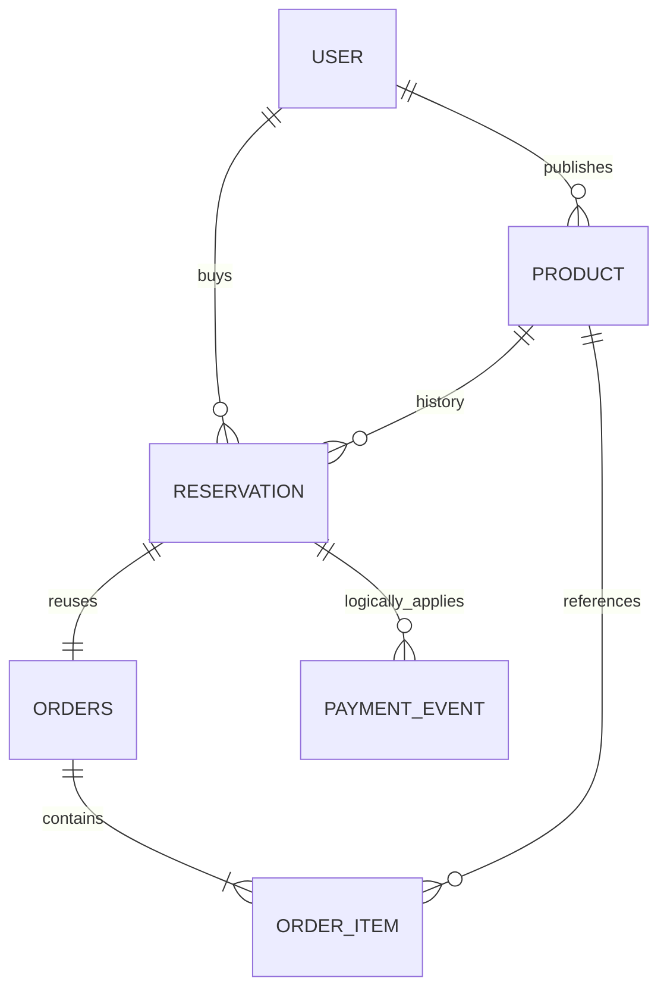
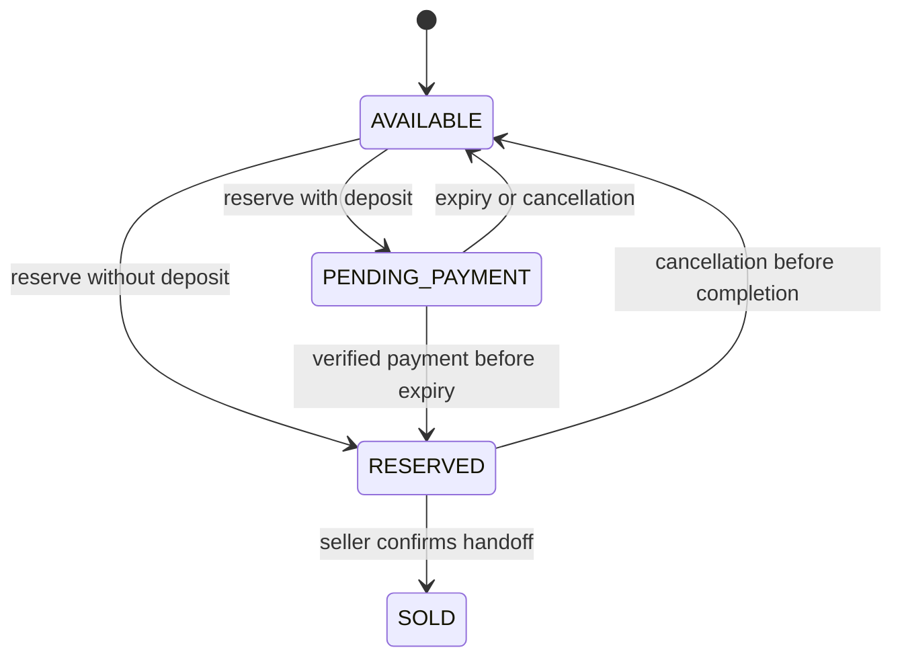
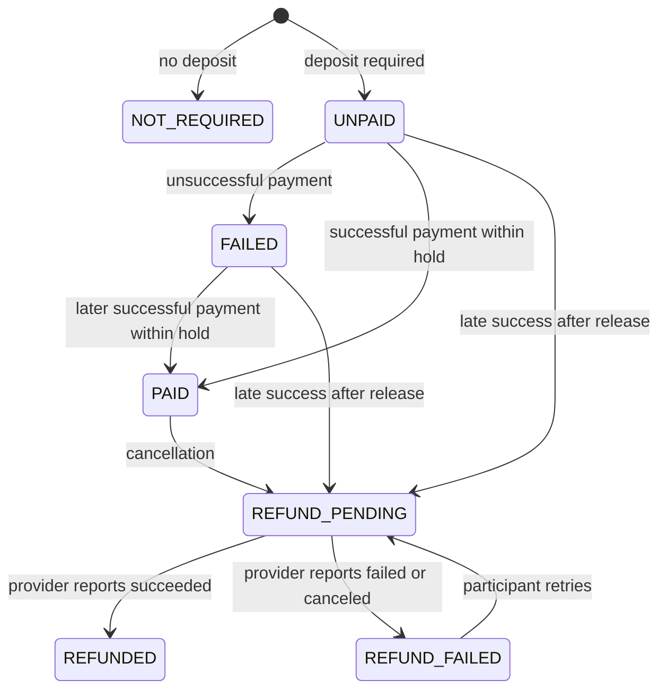

# Data model and transaction rules

## Reused structure

The original `com.zosh` Spring Boot application, JPA repositories, MySQL, User, Product, Order, OrderItem, JWT approach, React/Vite toolchain and MUI theme remain. New campus behavior is grouped under `com.zosh.campus`, not a separate service. Component scanning activates only campus controllers/services and the reviewed security configuration. All other routes are denied. Commercial payment and AI reference files are in `legacy/`; Razorpay is removed from the build.

`PaymentEvent` stores the unique provider event ID and receipt time. It has no physical FK to Reservation; the diagram's event association describes processing, not a declared SQL relationship.

| Entity | Campus-specific information |
| --- | --- |
| User | Existing identity, unique normalized email, BCrypt password; a customer can both buy and sell |
| Product | Owner → User; campus, apartment, public pickup area, private address, category, condition, images, UTC pickup slots, price/deposit cents, listing status, active reservation ID, version |
| Reservation | Product, buyer, original Order, snapshot of total/deposit, pickup slot, hold deadline, lifecycle/payment state, payment mode, unique Checkout Session/payment-intent IDs, refund ID/attempt/version |
| Order / OrderItem | Original order identity and history; exactly one OrderItem referencing the Product, quantity 1; original commercial shipping/totals are not used for settlement |
| PaymentEvent | Unique Stripe event ID; inserted in the same transaction as its state change |

No bank account, GST/tax ID, commercial seller registration, shipping or apartment membership is required. Original Seller and commercial models are kept for source continuity but a campus listing's **owner is User**. This avoids maintaining separate buyer/seller identities.

## States

The diagram shows Product availability. Each Reservation separately remains `PENDING_PAYMENT`, `RESERVED`, `COMPLETED`, `CANCELLED` or `EXPIRED`, so releasing a product does not erase transaction history.

A network exception while refunding leaves the state `REFUND_PENDING`, not `REFUND_FAILED` or `REFUNDED`, because the request might have succeeded externally. A new refund attempt number is used only after a definite provider failure. The adapter checks existing refund metadata to recover a result whose response or database commit was lost. Replayed successful payment events cannot regress `PAID`, `REFUND_PENDING`, `REFUND_FAILED` or `REFUNDED`.

## Locking and invariants

1. Mutations run inside a Spring transaction with explicit **READ_COMMITTED** isolation.
2. The service acquires a MySQL `SELECT ... FOR UPDATE` lock on Product before locking/refreshing Reservation. All mutation paths use this order.
3. `Product.activeReservationId` points to the only active reservation; the locked status check and reservation creation happen in the same transaction. Quantity is 1 when available, 0 while held/reserved/sold.
4. Reservation association IDs are immutable. Locking reads and refreshes avoid stale JPA entities; READ_COMMITTED prevents eager order associations from using MySQL's earlier consistent snapshot. This was required by an actual MySQL race test; see MAINTENANCE.md.
5. Release clears the product only if the old reservation still owns `activeReservationId`. A late payment cannot release or steal a newer buyer's hold.
6. Expiry is inclusive: `now >= expiresAt`. Hold deadline is the earlier of configurable `HOLD_MINUTES` and pickup time. The allowed configuration range is 1–120 minutes; default 15.
7. Amounts are integer USD cents; deposit zero means no deposit, otherwise positive and at most total price. The amount snapshot on Reservation is authoritative. The client never chooses the amount charged.
8. Signed Stripe events are verified, then the Checkout Session is retrieved server-side. Session ID, amount, currency and test mode must match. Event receipt and reservation changes commit together; transaction failures cause a retryable non-2xx response.
9. A completed reservation cannot cancel. Only the seller can complete; both participants can cancel before completion. A paid cancellation releases the item immediately while refund processing continues separately.

## API and privacy

Public GET: `/api/campus/config`, `/api/campus/listings`, `/api/campus/listings/{id}`. Listing search accepts `q`, `category`, `min`, `max` (cents), `condition`, `campus`, `apartment`, `page`. Pages contain at most 24 listings. Campus/apartment filters match exact names; keyword search escapes SQL wildcard characters.

POST `/api/campus/auth/signup` and `/auth/login` return a JWT and minimal user summary. The client stores the token in sessionStorage. All authenticated APIs derive the current user from the signed identity; they do not trust a submitted buyer/seller ID. Signup rejects unknown fields, including role injection.

Authenticated routes: POST `/listings`, POST `/reservations`, GET `/reservations`, GET `/reservations/{id}`, POST `/reservations/{id}/{checkout|cancel|complete|retry-refund|simulate}`. The simulate route additionally requires mock mode and the booking's buyer. It cannot change a Stripe booking.

Public listings are explicit DTOs without precise address, email, password, bank details or original Seller object. Booking DTOs are participant-only; the precise address is further hidden until `RESERVED` or `COMPLETED`. Historic cancelled/expired bookings no longer reveal it, although a participant who previously saw an address cannot be made to forget it. The UI tells sellers to keep private directions out of public descriptions.

The webhook is the only public payment mutation route: POST `/api/campus/webhooks/stripe`, authenticated by Stripe's signature over the unmodified body. Old payment-return and commercial admin endpoints are denied. No frontend redirect, query parameter or caller-provided payment status can confirm a Stripe payment.
